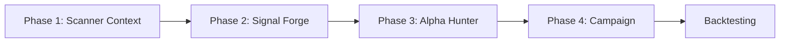

---
tags:
  - type/reference
  - project/vault
  - status/complete
created: 2026-04-04
---

# Mom_db — Research Vault Index

> Map of Content (MOC) for the quantitative momentum-Hawkes research system.
> Every `[[wikilink]]` resolves to a markdown in this vault.

---

## Architecture Overview

```
src/
├── models/     → [[Models Index]]        # Hawkes engines, MHP, GPU kernels
├── signals/    → [[Signals Index]]        # Filters, strategies, regime gating
├── backtest/   → [[Backtest Index]]       # Runners, optimizers, analytics
├── data/       → [[Data Index]]           # Loaders, DuckDB, LULD detection
└── utils/      → [[Utils Index]]          # Manifest, versioning
```

## Research Pipeline



| Phase | Doc | Script | Outputs |
|-------|-----|--------|---------|
| **1 — Scanner Context** | [[Phase 1 — Scanner Context]] | `research/phase_1_context/build_scanner_context.py` | `scanner_context.parquet` |
| **1b — Extended Hours** | [[Phase 1b — Extended Hours]] | *(no script — manual notebook)* | `extended_context.parquet` |
| **2 — Signal Forge** | [[Phase 2 — Signal Forge]] | `research/phase_2_signal_forge/build_signal_forge*.py` | `feature_matrix_v1.parquet`, `feature_matrix_v2_ext.parquet` |
| **3 — Alpha Hunter** | [[Phase 3 — Alpha Hunter]] | `research/phase_3_alpha_hunter/build_alpha_hunter.py` | `xgb_regime_model.json`, `fused_dataset.parquet` |
| **4 — Campaign** | [[Phase 4 — Campaign]] | `research/phase_4_campaign/build_campaign*.py` | `prime_candidates.parquet`, `scored_universe.parquet` |

## Strategy Evolution

| Version | Doc | Runner | Key Innovation |
|---------|-----|--------|----------------|
| **v1** | [[Bivariate Strategy]] | — | Nautilus 3-phase: catalyst → entry → exit |
| **v2** | [[V2 Backtest Runner]] | `src/backtest/v2_runner.py` | Auto-tune loop (adjusts decay/time-stop) |
| **v3** | [[Archetype Strategy]] | `src/backtest/archetype_runner.py` | Zero-warmup cold-start via archetype seeding |
| **v5** | [[V5 Backtest Runner]] | `src/backtest/v5_runner.py` | 6-gate entry, 7-exit, dynamic α refit |

## Module Documentation

### Models
- [[Hawkes Engine]] — ★ Core bivariate Hawkes (batch + online)
- [[Tensor Engine]] — GPU associative-scan Hawkes
- [[MHP Model]] — D-dimensional multivariate Hawkes (nn.Module)
- [[GPU Accelerated MHP]] — Batched rolling MHP with AMP
- [[Rolling Hawkes Engine]] — Sliding-window MHP estimation
- [[Rolling Pipeline]] — CLI: gating → GPU MHP → export
- [[MHP Analysis]] — Causality, IRF, interaction matrix
- [[MHP Data Loader]] — Bivariate event stream preparation
- [[Regime Hawkes Correlation]] — Regime-gated lead/lag analysis

### Signals
- [[Signal Processor]] — 4-mode structural alpha filter
- [[Alpha Config]] — v5 strategy parameter container
- [[Archetype Classifier]] — Cold-start classification & seeding
- [[Archetype Injector]] — Instant-on parameter injection
- [[Bivariate Strategy]] — Nautilus 3-phase momentum strategy
- [[Archetype Strategy]] — Nautilus 5-phase archetype-seeded strategy
- [[Flow Z-Score Indicator]] — Volume anomaly visualization
- [[Intensity Gating]] — Schmitt-trigger regime detection

### Backtest
- [[V5 Backtest Runner]] — Production v5 tick-by-tick simulation
- [[V2 Backtest Runner]] — Reactive-momentum v2 with auto-tune
- [[Archetype Backtest Runner]] — Archetype-seeded v3 simulation
- [[Optimizer]] — 3-iteration self-optimization loop
- [[Parallel Runner]] — ProcessPoolExecutor batch runner
- [[Slippage Engine]] — L1 quote-based fill simulation
- [[Signal Bakeoff]] — 4-mode filter comparison
- [[GPU Batch Runner]] — CUDA tensor backtest pipeline
- [[Stat Validator]] — Large-scale statistical validation

### Analytics
- [[Audit Suite]] — 4-audit forensic diagnostics
- [[Trade Data Timestamp Audit]] — Phase V0.0 schema drift & timestamp corruption sweep across `high_momentum` (needs review)
- [[Quote Data Timestamp Audit]] — Phase V0.0b sibling sweep across `quote_data`; corpus confirmed clean (0.22% of records anomalous) plus 4 unreadable files (needs review)
- [[Latency Audit]] — Burst latency forensics
- [[Excursion V1]] — MFE/MAE/PCR v1
- [[Excursion V2]] — Toxic clustering + auto-thresholds
- [[Exit Autopsy]] — Premature-exit diagnostic
- [[Trade Analyzer]] — Polars deep analytics
- [[GPU Monte Carlo]] — 10k-path MC equity curves
- [[Kelly Engine]] — Rolling Kelly position sizing
- [[Retail Impact]] — Spread transaction cost model

### Data
- [[DuckDB Connection]] — Connection manager
- [[DuckDB Ingest]] — 11-loader data pipeline
- [[Polars Loader]] — ★ Canonical data loader
- [[Pandas Loader]] — Legacy loader
- [[LULD Halt Detection]] — Halt detection & timeline compression
- [[Database Split]] — Companion doc for prepare_database_split.py
- [[LULD Halt Logic]] — Companion doc for LULD halt logic module
- [[Data Paths]] — Companion doc for paths.py path resolver

### Utils
- [[Manifest]] — Backtest versioning & reproducibility

## Notebooks
- [[Notebooks Index]]

## Research Notes & Theory
- [[Price Impact Bridge]] — OFI + Hawkes two-layer price impact framework (Cont, Kukanov & Stoikov)

## Alpha Hypotheses
- [[Scanner-Hawkes-OFI Impact]] — ★ Active · Scanner rank × event-time Hawkes × OFI price impact bridge; 3-gate entry, 3-exit; addresses clock-time beta degeneracy at high TPS
- [[Scanner-EPG-Momentum]] — Active · Simplified EPG-gated momentum (no OFI/regime stack); EPG rising-edge entry, EXIT_D + LULD + EPG-close exits; lives in `scanner-epg-momentum/`
- [[_template]] — blank alpha hypothesis template

## Brainstorm & Working Notes

- [[README]] — brainstorm directory guide
- [[v5_Battle_Results]] — AlphaMomentumHawkes v5 Battle Royale (200-event full run)
- [[v5_3_Final_Report]] — v5.3 Temporal Beta Hybrid final report

## Inventory

- [[FILE_INVENTORY]] — comprehensive Python file inventory (auto-generated)
- [[SRC_MODULE_INVENTORY]] — src/ module-level Obsidian inventory (auto-generated)

## Prompt Templates

- [[alpha-spec-template]] — template for formalizing an alpha hypothesis into a full spec
- [[backtest-spec-template]] — template for defining a strategy spec for backtesting

## Archives
- [[Archive Inventory]] → `archive/INVENTORY.md`
