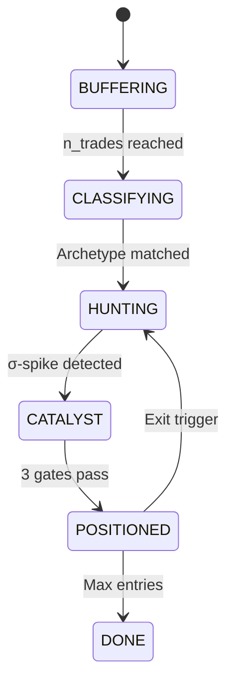

---
tags:
  - type/implementation
  - domain/signal
  - project/v5-strategy
  - status/complete
created: 2026-04-04
---

# Archetype Strategy

> **File:** `src/signals/archetype_strategy.py` · **Lines:** 430

## Purpose

Nautilus-compatible archetype-seeded momentum Hawkes strategy with **zero-warmup cold-start**. Replaces the 30% warmup period of [[Bivariate Strategy]] with instant archetype classification.

## Phases

### BUFFERING → CLASSIFYING
Buffer first 20 trades → classify against archetype library

### Dynamic Refit
After 120s of live data, replaces seeded params with live-fitted α values

## Key Parameters
- `classify_n_trades=20`, `seed_warmup_sec=900`
- `dynamic_refit_sec=120` (replace seeded → live-fitted)
- Entry & exit same as [[Bivariate Strategy]]

## Dependencies
- **Internal:** [[Hawkes Engine]], [[Archetype Classifier]]
- **External:** `nautilus_trader`, `numpy`, `logging`

---
*Back to [[Signals Index]] · [[00-Index]]*
