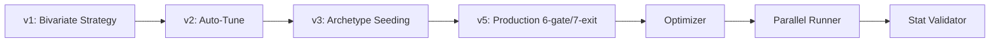

---
tags:
  - type/reference
  - domain/backtest
  - project/src-core
  - status/complete
created: 2026-04-04
---

# Backtest Index

> Backtesting runners, optimizers, batch execution, and analytics.

## Runners

| Module | File | Lines | Version | Key Innovation |
|--------|------|-------|---------|----------------|
| [[V5 Backtest Runner]] | `src/backtest/v5_runner.py` | 580 | v5 | 6-gate entry, 7-exit, dynamic α refit |
| [[V2 Backtest Runner]] | `src/backtest/v2_runner.py` | 480 | v2 | Auto-tune loop |
| [[Archetype Backtest Runner]] | `src/backtest/archetype_runner.py` | 600 | v3 | Zero-warmup archetype seeding |

## Optimisation & Execution

| Module | File | Lines | Purpose |
|--------|------|-------|---------|
| [[Optimizer]] | `src/backtest/optimizer.py` | 310 | 3-iteration self-optimisation |
| [[Parallel Runner]] | `src/backtest/parallel_runner.py` | 300 | ProcessPoolExecutor batch |
| [[Slippage Engine]] | `src/backtest/slippage_engine.py` | 170 | L1 quote-based fill simulation |
| [[Signal Bakeoff]] | `src/backtest/signal_bakeoff.py` | 570 | 4-mode filter comparison |
| [[GPU Batch Runner]] | `src/backtest/gpu_batch_runner.py` | 430 | CUDA tensor backtest pipeline |
| [[Stat Validator]] | `src/backtest/stat_validator.py` | 480 | Large-scale statistical validation |

## Analytics (`src/backtest/analytics/`)

| Module | File | Lines | Purpose |
|--------|------|-------|---------|
| [[Audit Suite]] | `analytics/audit.py` | 430 | 4-audit forensic diagnostic |
| [[Latency Audit]] | `analytics/latency_audit.py` | 430 | Burst latency forensics |
| [[Excursion V1]] | `analytics/excursion_v1.py` | 250 | MFE/MAE/PCR v1 |
| [[Excursion V2]] | `analytics/excursion_v2.py` | 530 | Toxic clustering + auto-thresholds |
| [[Exit Autopsy]] | `analytics/exit_autopsy.py` | 440 | Premature-exit diagnostic |
| [[Trade Analyzer]] | `analytics/trade_analyzer.py` | 340 | Polars deep analytics |
| [[GPU Monte Carlo]] | `analytics/gpu_monte_carlo.py` | 320 | 10k-path MC equity curves |
| [[Kelly Engine]] | `analytics/kelly_engine.py` | 320 | Rolling Kelly position sizing |
| [[Retail Impact]] | `analytics/retail_impact.py` | 310 | Spread transaction cost model |

## Strategy Version Evolution

---
*Back to [[00-Index]]*
