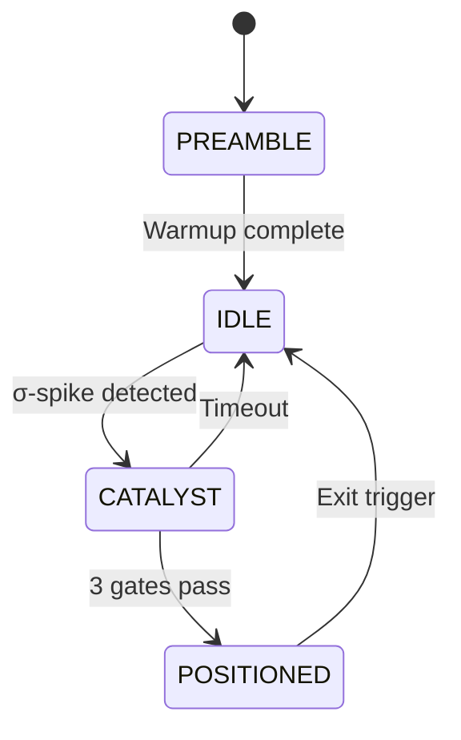

---
tags:
  - type/implementation
  - domain/hawkes
  - domain/signal
  - project/v5-strategy
  - status/complete
created: 2026-04-04
---

# Bivariate Strategy

> **File:** `src/signals/bivariate_strategy.py` · **Lines:** 395

## Purpose

Nautilus-compatible reactive-momentum Hawkes strategy (v2) with a three-phase execution framework.

## Phases

### Phase A — Catalyst Detection
- σ-spike on ROC + λ\_buy (3.5σ default)
- Velocity impulse fast-path (4σ, 5 consecutive)

### Phase B — 3-Gate Entry
1. **Price Ratio:** price / catalyst_price ≥ 0.98
2. **Intensity Percentile:** λ\_buy in top 50th pctile (adaptive)
3. **Volume Delta:** CVD > 0 (buy pressure)
- **Backside filter:** reject if ROC < 0 and λ declining

### Phase C — Exit
- **PEAK_DECAY:** 25% λ decay from peak
- **SELL_DOM:** sell intensity > 3× buy
- **TIME_STOP:** 120s with <1% PnL

## Config: `BivariateMomentumHawkesConfig`

Key parameters: `catalyst_sigma=3.5`, `gate1_price_ratio=0.98`, `gate2_top_pctile=50.0`, `exit_peak_decay_pct=25.0`, `exit_time_stop_sec=120.0`, `velocity_sigma=4.0`

## Dependencies
- **Internal:** [[Hawkes Engine]]
- **External:** `nautilus_trader`, `numpy`, `logging`

---
*Back to [[Signals Index]] · [[00-Index]]*
