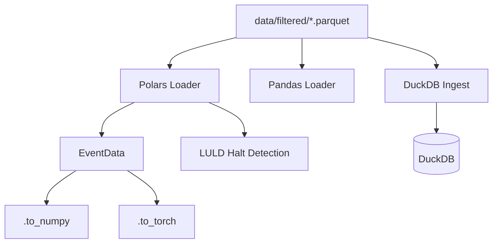

---
tags:
  - type/reference
  - domain/data
  - project/src-core
  - status/complete
created: 2026-04-04
---

# Data Index

> Data loading, DuckDB storage, and LULD halt detection.

## Modules

| Module | File | Lines | Purpose |
|--------|------|-------|---------|
| [[Polars Loader]] | `src/data/polars_loader.py` | 420 | ★ Canonical data loader |
| [[Pandas Loader]] | `src/data/pandas_loader.py` | 200 | Legacy loader |
| [[DuckDB Connection]] | `src/data/db.py` | 10 | Connection manager |
| [[DuckDB Ingest]] | `src/data/ingest.py` | 400 | 11-loader pipeline |
| [[LULD Halt Detection]] | `src/data/luld_halt_detection.py` | 290 | Halt detection & timeline |

## Data Flow

## Data Sources (314 GB)

| Directory | Contents | Count |
|-----------|----------|-------|
| `data/filtered/` | Per-event trades + quotes parquet | ~20k events |
| `data/daily/` | Daily OHLCV bars per ticker | ~2k tickers |
| `data/minute/` | Minute bars per ticker/date | ~100k files |
| `data/second10/` | 10-second bars | ~15k files |
| `data/quote_data/` | Raw tick quotes | ~8k files |
| `data/trade_data/` | Raw tick trades | ~5k files |
| `data/momentum_events/` | Power-law filtered events | 3 files |
| `data/metadata/` | Collection stats, symbols | ~10 files |
| `data/market-hours/` | Market hours JSON | ~2k files |
| `data/symbol-properties/` | Symbol properties CSV | 1 file |

---
*Back to [[00-Index]]*
