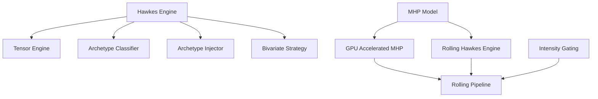

---
tags:
  - type/reference
  - domain/hawkes
  - project/src-core
  - status/complete
created: 2026-04-04
---

# Models Index

> Hawkes process engines, multivariate models, and GPU-accelerated kernels.

## Core Engines

| Module | File | Lines | Purpose |
|--------|------|-------|---------|
| [[Hawkes Engine]] | `src/models/hawkes_engine.py` | 546 | ★ Bivariate Hawkes (batch + online) |
| [[Tensor Engine]] | `src/models/tensor_engine.py` | 355 | GPU associative-scan Hawkes |

## Multivariate Hawkes (MHP)

| Module | File | Lines | Purpose |
|--------|------|-------|---------|
| [[MHP Model]] | `src/models/mhp_model.py` | 261 | D-dimensional MHP (nn.Module) |
| [[GPU Accelerated MHP]] | `src/models/gpu_accelerated_mhp.py` | 285 | Batched rolling MHP with AMP |
| [[Rolling Hawkes Engine]] | `src/models/RollingHawkesEngine.py` | 128 | Sliding-window MHP estimation |
| [[Rolling Pipeline]] | `src/models/rolling_pipeline.py` | 131 | CLI: gating → GPU MHP → export |

## Analysis & Data

| Module | File | Lines | Purpose |
|--------|------|-------|---------|
| [[MHP Analysis]] | `src/models/analysis.py` | 280 | Causality, IRF, interaction matrix |
| [[MHP Data Loader]] | `src/models/data_loader.py` | 213 | Bivariate event stream prep |
| [[Regime Hawkes Correlation]] | `src/models/regime_hawkes_corr.py` | 260 | Regime-gated lead/lag |

## Dependency Graph

---
*Back to [[00-Index]]*
