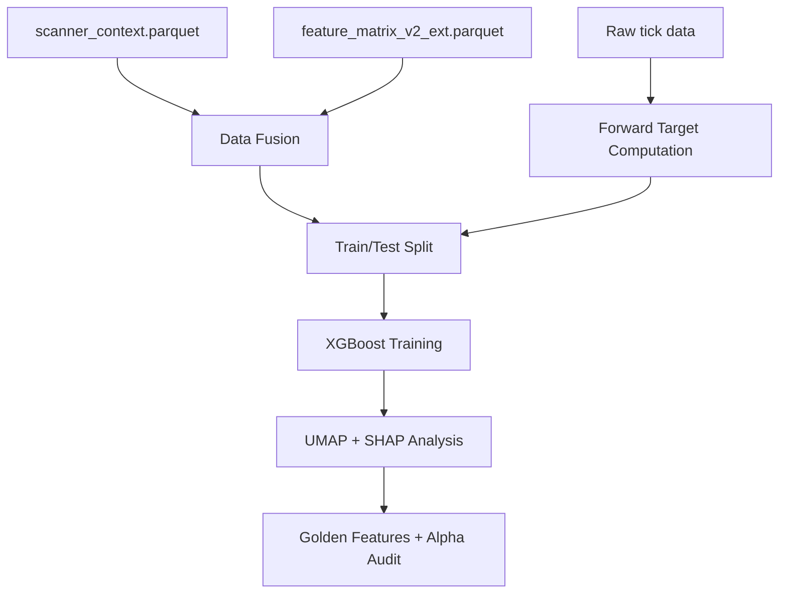

---
tags:
  - type/results
  - domain/signal
  - project/src-core
  - status/complete
created: 2026-04-04
---

# Phase 3 — Alpha Hunter

> **Script:** `research/phase_3_alpha_hunter/build_alpha_hunter.py` · **Lines:** 1065
> **Outputs:** `xgb_regime_model.json`, `fused_dataset.parquet`

## Purpose

ML regime classification: fuses Phase 1 + Phase 2 features, engineers forward targets from raw ticks, trains XGBoost, and visualises with UMAP + SHAP.

## Pipeline

## Forward Targets

| Target | Formula | Window |
|--------|---------|--------|
| $Y_{Contagion}$ | Integrated Hawkes AUC | 09:45–10:00 |
| $Y_{Efficiency}$ | MFE / MAE ratio | 09:45–09:55 |

## XGBoost Training
- 80/20 temporal split (no look-ahead)
- Monotonic constraint on `gap_rank`
- Inverse-rank sample weighting: $w = \frac{1}{\text{rank}^2} \times \log(\text{vol})$
- Early stopping on validation set

## Outputs

| File | Purpose |
|------|---------|
| `fused_dataset.parquet` | Merged Phase 1 + 2 + forward targets |
| `xgb_regime_model.json` | Trained XGBoost model |
| `GOLDEN_FEATURES.md` | Top features by SHAP importance |
| `Alpha_Audit.md` | Model performance report |
| `plots/umap_regime_map.png` | UMAP cluster visualisation |
| `plots/shap_beeswarm.png` | SHAP beeswarm plot |
| `plots/calibration_curve.png` | Probability calibration |

## Artifacts

- [[Alpha_Audit]] — model performance report
- [[GOLDEN_FEATURES]] — top features by SHAP importance

## Data Sources
- [[Phase 1 — Scanner Context|scanner_context.parquet]]
- [[Phase 2 — Signal Forge|feature_matrix_v2_ext.parquet]]
- `data/filtered/*/trades.parquet`

## Consumers
- [[Phase 4 — Campaign]]

---
*Back to [[00-Index]]*
