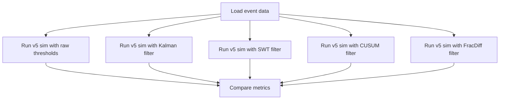

---
tags:
  - type/implementation
  - domain/signal
  - domain/backtest
  - project/src-core
  - status/complete
created: 2026-04-04
---

# Signal Bakeoff

> **File:** `src/backtest/signal_bakeoff.py` · **Lines:** 570

## Purpose

Signal Bake-Off runner comparing 4 filter modes (Kalman-Bucy, SWT, CUSUM, FracDiff) against raw CVD/Hawkes thresholds. Measures SNR, false positive rate, true positive rate, and profit factor for each mode.

## Workflow

## Key Functions

| Function | Purpose |
|----------|---------|
| `_run_filtered_simulation(...)` | v5 loop with [[Signal Processor]] filtered entry/exit |
| `run_bakeoff_event(event_name, mode, ...)` | Single event + mode |
| `run_bakeoff_batch(event_names, modes, ...)` | Full bake-off (parallel) |

## Dependencies
- **Internal:** [[Signal Processor]], [[Polars Loader]], [[Archetype Injector]], [[Hawkes Engine]]
- **External:** `numpy`, `json`, `concurrent.futures`

---
*Back to [[Backtest Index]] · [[00-Index]]*
