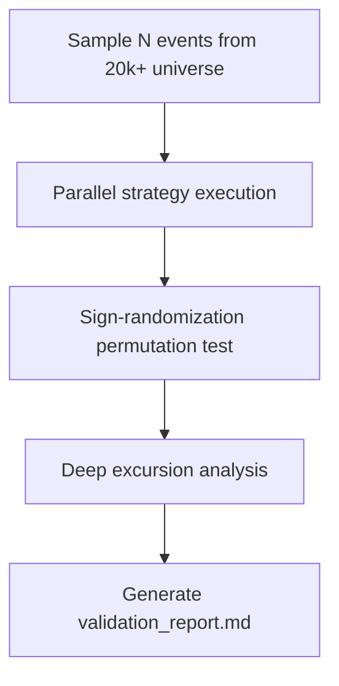

---
tags:
  - type/implementation
  - domain/backtest
  - project/src-core
  - status/complete
created: 2026-04-04
---

# Stat Validator

> **File:** `src/backtest/stat_validator.py` · **Lines:** 480

## Purpose

Large-scale statistical validation for v5. 4 phases: sample → execute → permutation test → report.

## Pipeline

## Phases

### Phase 1 — Sampling
Stratified random sampling from event universe with min magnitude filter.

### Phase 2 — Execution
Sequential (or parallel via [[Parallel Runner]]) v5 simulation with checkpointing.

### Phase 3 — Permutation Test
Monte Carlo $H_0$ test: randomly flip trade PnL signs 1000× times to compute p-value. Tests whether observed aggregate PnL is significantly different from random.

### Phase 4 — Report
Generates `validation_report.md` with distribution plots, duration heatmaps, and excursion profiles.

## Key Functions

| Function | Purpose |
|----------|---------|
| `sample_events(n, min_magnitude, seed)` | Stratified random sampling |
| `run_validation_batch(event_names, ...)` | Sequential with checkpointing |
| `run_permutation_test(summaries, ...)` | Monte Carlo p-value |
| `generate_report(...)` | Markdown report + plots |

## Dependencies
- **Internal:** [[Polars Loader]], [[Parallel Runner]], [[Trade Analyzer]]
- **External:** `numpy`, `matplotlib`, `json`, `argparse`

---
*Back to [[Backtest Index]] · [[00-Index]]*
