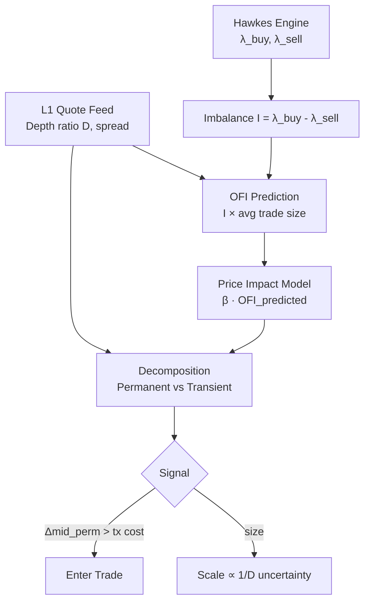

---
tags:
  - type/idea
  - domain/price-impact
  - domain/ofi
  - project/hawkes-ofi-impact
  - status/wip
created: 2026-04-04
---

# Price Impact Bridge

> Methodology note — bridging [[Hawkes Engine]] intensity forecasts to mid-price movement predictions via Order Flow Imbalance (OFI) decomposition.

> **Implements:** [[Scanner-Hawkes-OFI Impact]] Layer 2 — `PriceImpactBridge` class in `src/models/price_impact_bridge.py`

## Core Problem

The [[Hawkes Engine]] gives you intensity forecasts — expected arrival rates of aggressive buys vs. sells over a short horizon. But **intensity ≠ price move**. A bridge is needed:

> Given an order flow imbalance, how much does the mid actually move, and how persistently?

The answer is a **price impact model**. The right one depends on timescale and whether you care about adverse selection or directional prediction.

---

## Layer 1 — Hawkes Forecast (existing)

From the [[Bivariate Strategy]] engine:

$$\lambda_{buy}(t), \quad \lambda_{sell}(t) \quad \text{over horizon } h$$

$$I(t) = \lambda_{buy}(t) - \lambda_{sell}(t) \quad \text{(expected imbalance)}$$

---

## Layer 2 — Order Flow Imbalance (OFI)

**Reference:** Cont, Kukanov & Stoikov — *The Price Impact of Order Book Events* (2014)

Price changes are driven by the joint process of trade arrivals **and** queue dynamics at the best bid/ask. With L1 data, OFI is:

$$\text{OFI}(t) = \Delta Q_{bid}(t) - \Delta Q_{ask}(t)$$

where $\Delta Q$ captures changes in best-quote queue sizes plus signed trade flow.

**Empirically:** contemporaneous OFI explains **60–80%** of short-horizon mid-price changes in linear regression — unusually high for microstructure features.

### Why Layer OFI on Hawkes Rather Than Use It Alone

| Feature | Type | Info |
|---------|------|------|
| Raw OFI | Contemporaneous | Coincident indicator, no lead |
| Hawkes intensities | Forward-looking | Leading indicator |
| **Hawkes-predicted OFI** | **Forward-looking** | **Alpha lives here** |

Using Hawkes intensities to predict *future* OFI imbalance converts a coincident signal into a **leading indicator**.

### Price Impact Model

$$\Delta mid(t, t+h) = \beta \cdot \widehat{\text{OFI}}(t, t+h) + \varepsilon$$

where:

$$\widehat{\text{OFI}}(t, t+h) = \bigl(\lambda_{buy}(t) - \lambda_{sell}(t)\bigr) \times \bar{S}$$

and $\bar{S}$ is the historical average trade size (calibrated from trade data).

---

## Decomposing Impact: Transient vs. Permanent

OFI alone does not tell you how much of the move is **permanent** (informed flow, real signal) vs. **transient** (temporary imbalance that reverts). For a momentum strategy this is critical — you want to ride permanent impact and avoid reversion.

### Permanent Component (Hasbrouck Information Share)

Each trade has a permanent price impact proportional to its informativeness, proxied by:

$$\text{InformedProxy} = \frac{\text{trade size}}{\text{best ask/bid depth at time of trade}}$$

Large trades relative to depth → more informed → larger permanent impact.

### Transient Component (Decay Fitting)

Fit exponential decay on mid-price response to trades. Regress $\Delta mid(t + \tau)$ on signed trade volume for multiple lags $\tau$. The decay curve gives the reversion timescale.

### Depth Ratio as Regime Signal

**Depth ratio** from L1 data:

$$D(t) = \frac{Q_{bid}^{best}(t)}{Q_{ask}^{best}(t)}$$

| Depth Condition | Impact Type | Interpretation |
|----------------|-------------|----------------|
| Very imbalanced (D ≫ 1 or D ≪ 1) | Permanent | Thin side gets eaten; MM already repositioning |
| Balanced (D ≈ 1) | Transient | Impact reverts; liquidity absorbs pressure |

$D(t)$ acts as a **real-time momentum/mean-reversion regime switch** — it tells you in real time whether a move is likely to stick or revert.

---

## Full Signal Stack

### Layer Summary

| Layer | Inputs | Outputs |
|-------|--------|---------|
| **1 — Bivariate Hawkes** | Trade tick stream | $\lambda_{buy}(t)$, $\lambda_{sell}(t)$, $I(t)$ |
| **2 — Price Impact** | $I(t)$, depth ratio $D(t)$, avg trade size $\bar{S}$ | $\Delta mid_{perm}$, $\Delta mid_{trans}$ |
| **Signal** | $\Delta mid_{perm}$ vs. transaction cost | Trade / no-trade |
| **Sizing** | $D(t)$ uncertainty | Position scale |

---

## Practical Considerations

### Quote Stuffing / Flickering Quotes
L1 changes at ultra-high frequency include noise from canceled quotes. Apply a **minimum persistence filter** (e.g., only register L1 changes that persist >50 ms) or OFI will be inflated with garbage.

### Contemporaneous vs. Lagged Leakage
- Hawkes intensities are clean — genuinely forward-looking.
- OFI computed on the **same interval as the label** overfits badly.
- Use **Hawkes-predicted OFI** as the feature, never realized OFI.

### Spread Normalization
Price impact scales with the spread. Normalize OFI and impact by current bid-ask spread:

$$\text{OFI}_{norm}(t) = \frac{\text{OFI}(t)}{\text{spread}(t)}$$

This stabilizes the model across different market conditions and times of day.

---

## Implementation Hooks

| Component | Where to Implement | Notes |
|-----------|-------------------|-------|
| OFI computation | [[Signal Processor]] or new `OFIIndicator` | Time-filtered queue delta accumulator |
| Depth ratio $D(t)$ | [[Bivariate Strategy]] gate additions | Already has L1 access |
| $\beta$ calibration | [[MHP Analysis]] or offline notebook | Regress realized OFI vs. Δmid on historical data |
| Permanent/transient split | New `ImpactDecomposer` class | Hasbrouck IS + lag regression |
| Spread normalization | [[Alpha Config]] | Add `spread_norm: bool` flag |

---

## Related Notes

- [[Hawkes Engine]] — Layer 1 intensity source
- [[Bivariate Strategy]] — Current momentum strategy consuming λ_buy / λ_sell
- [[Flow Z-Score Indicator]] — Complementary volume anomaly signal
- [[Intensity Gating]] — Regime gating that this model extends
- [[Retail Impact]] — Spread transaction cost model (relevant for threshold calibration)
- [[Signal Processor]] — Filter layer where OFI could be integrated
- [[Phase 2 — Signal Forge]] — Feature matrix build where OFI features belong

---

*Back to [[Models Index]] · [[Signals Index]] · [[00-Index]]*
